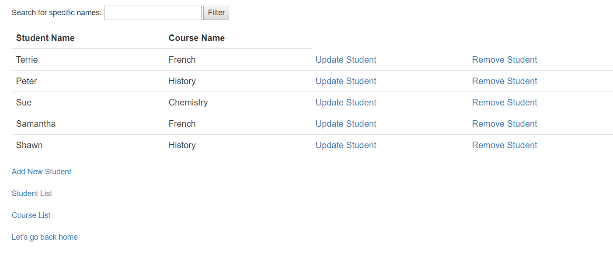

# Lab13StudentEnrollment
This website is for administration purposes at the Odd School.  

## Summary
This website is meant only for administrators to access
and it allows for them to manage students and courses.  
This website allows for courses to be created, updated, and deleted.  
This website also allows for students to be added, updtaed, and deleted from the school.  
Courses could also be looked at in more details which will provide the basic information 
along with all of the students currently enrolled in the course.  
To delete a course, there must be no students currently enrollled otherwise the user will be redirected to an error page.

## Visuals
Here is how the create page for the course looks like:  
  
Here is how the courses table after adding a course looks like:  
  
Here is how the update page for the course looks like:  
  
Here is how the course table after updating a course looks like:  
  
Here is how the course table after deleting a course looks like:  
  
Here is how the details page for the course looks like:  
  
Here is how the error page for when the user tries to delete a course with students enrolled looks like:  
  
Here is how the create page for the student looks like:  
  
Here is how the students table after adding a student looks like:  
  
Here is how the update page for the student looks like:  
  
Here is how the students table after updating a student looks like:  
  
Here is how the students table after deleting a student looks like:  
  

## How to access:
1. Go to the site: http://jimmychanglab13studentenrollment.azurewebsites.net/  
2. Click on either "Click here to manage courses" or "Click here to manage students"  
3. Do as you wish  

## References
Eric Singleton Jr. helped with logic behind updating students.  
Erik Plyushko helped with logic behind creating/deleting students.  